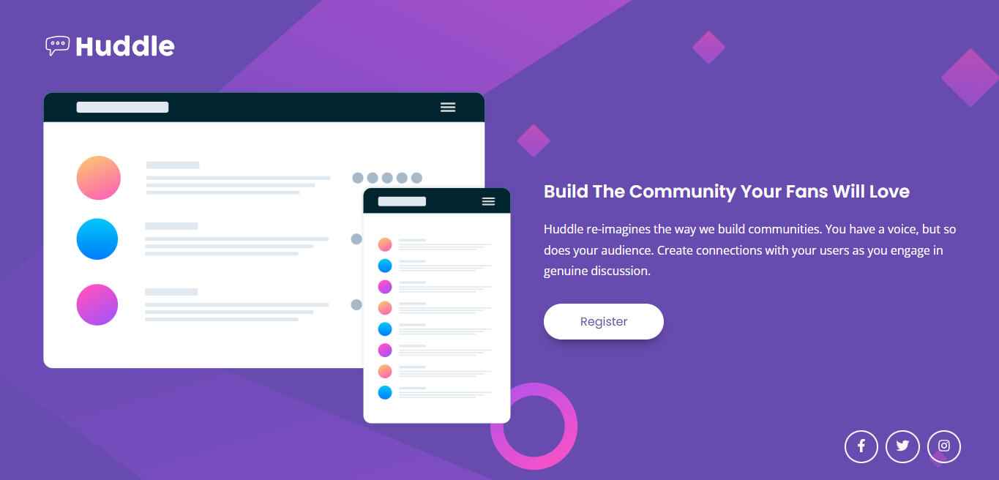

# 📕 Descrição
Ao finalizar os módulos de HTML e CSS avançados do curso DevQuest, fui capaz de desenvolver essa landing page do site front end mentor, utilizando flexbox e além do layout padrão, adicionei também uma escala de 1.1 ao passar o mouse sobre o botão register.

[Clique aqui para acessar](https://edu-almeidaf.github.io/quest-html-css-avancado/)


# 🔧 Ferramentas Utilizadas
- HTML5
- CSS3


# 💡Lições aprendidas
```JavaScript
let licoesAprendidas = [
 'Flexbox',
 'Transitions',
 'Responsividade',
 'Semântica de HTML e CSS' 
]

